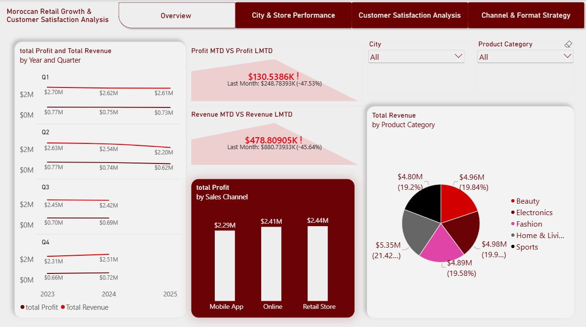
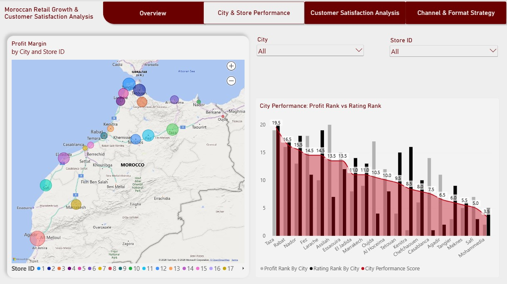
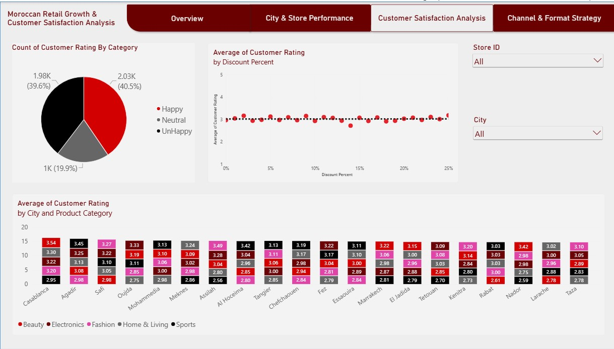
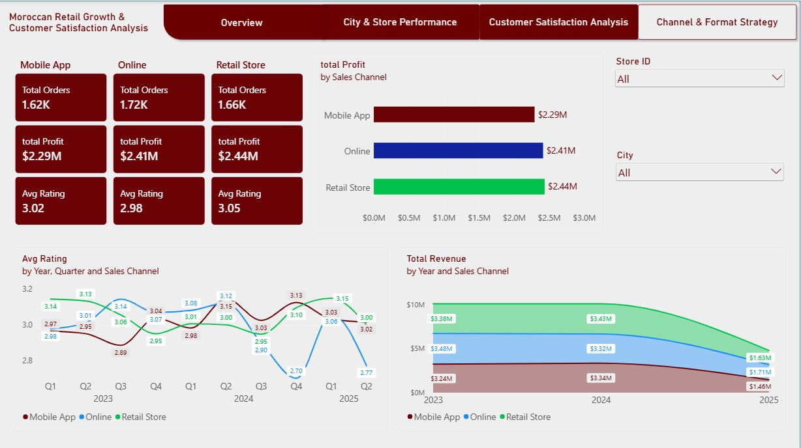

# retail-growth-dashboard
This is a Moroccan Retail Growth &amp; Customer Satisfaction Dashboard built with Power BI

## Project Overview

This Power BI dashboard analyzes retail performance data to help Moroccan retail companies make data-driven decisions about **store expansion**, **customer satisfaction**, and **channel strategy**.

The dashboard answers **4 critical business questions** that Moroccan retailers face today:

1. **Where should we open our next store?**
2. **Why is customer satisfaction so low?**
3. **Which store format should we prioritize?**
4. **Which stores are underperforming and why?**

---

## 📊 Dashboard Pages

### Page 1: Overview

**Key Insights:**
- Revenue dropped 45.64%, and profit dropped 47.53% compared to last month.
- Q1 2023 had $2.70M in revenue vs. the last quarter of 2025 Q2 had $2.20M in revenue. Profit dropped from $0.77M to $0.62M.
- Mobile App ($2.29M), Online ($2.41M), and Retail Store ($2.44M) are almost equal in total profit.
- Home & Living leads slightly (21.42%), but all categories are within the 19- 21% range.

---

### Page 2: City & Store Performance

**Key Insights:**
- Mohammedia is the top performer — Lowest City Performance Score (3.5), meaning it has the best combination of profit rating rank and customer rating rank.
- Taza is the worst performer — Highest score (19.5), indicating both low profit rating and low customer satisfaction.
- Safi and Meknes are strong performers — Scores of 5.0 and 5.5, respectively.

---

### Page 3: Customer Satisfaction Analysis

**Key Insights:**
- 39.6% of customers are UNHAPPY — Only 40.5% are happy. This is a major satisfaction crisis.
- Discounts do NOT improve satisfaction — The scatter plot shows flat ratings (~3.0) regardless of discount percentage (0-25%). Discounts are not solving the satisfaction problem.
- Casablanca has the highest customer ratings — Beauty (3.54), Electronics (3.22), Home & Living (3.30) are all strong in Casablanca.
- Taza has the lowest customer ratings — Beauty (2.89), Home & Living (2.78), Sports (2.83).

---

### Page 4: Channel & Format Strategy

**Key Insights:**
- Retail Store is the best performer overall — Highest profit ($2.44M), highest rating (3.05), and most orders (1.66K).
- Online channel satisfaction is declining — Lowest rating (2.98) and declining satisfaction over time (dropped to 2.77 in Q2 2025).
- All channels are losing revenue — Revenue dropped significantly from 2023 to 2025 across all channels.
- Retail Store satisfaction recovered — after dropping to 2.95 in Q4 2023, it rose to 3.15 in Q1 2025 but fell back to 3.00 in Q2 2025.
- Online spiked in Q1 2025 — Rating jumped to 3.06 but crashed to 2.77 in Q2 2025 — the lowest of all channels.

---

## 🛠️ Tools & Technologies

**Power BI Desktop** Dashboard development
**DAX** Calculated measures and columns
**Power Query** Data cleaning and transformation
**Star Schema** Data modeling (Fact + Dimension tables)

---

## 📁 Data Model

---

## Author
Khadija Chaabaoui
Data Analyst Junior | Power BI
LinkedIn: www.linkedin.com/in/khadija-chaabaoui-71743a375
Email: chaabaoui123456@gmail.com
